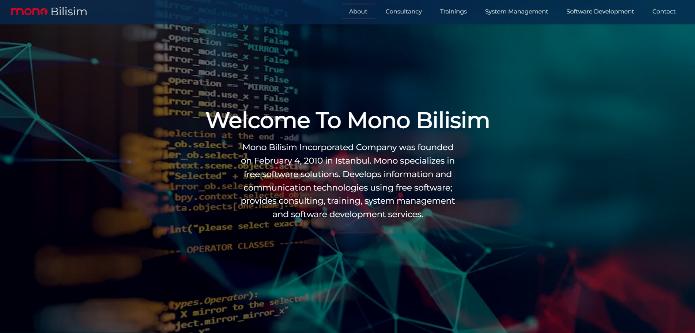
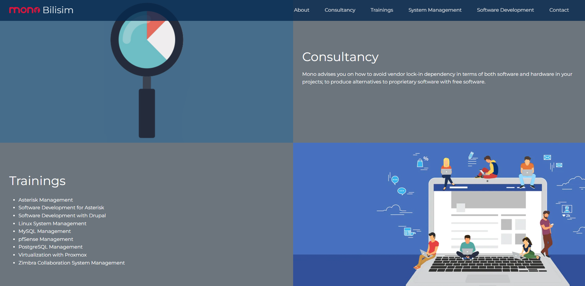
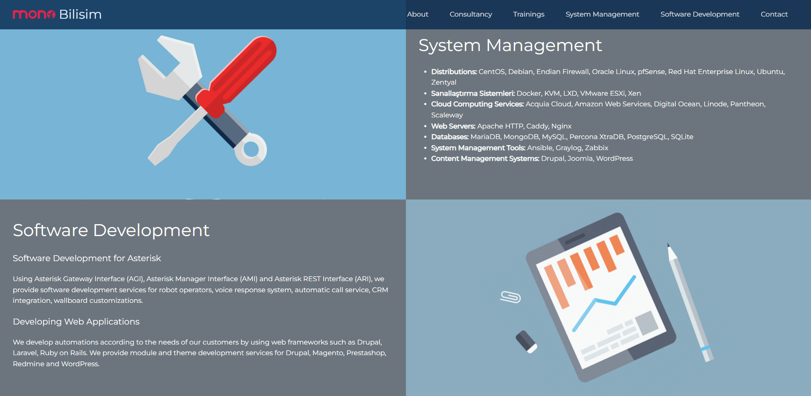
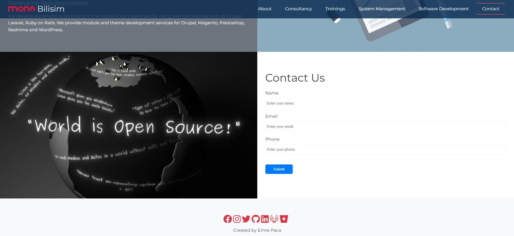

# Internship Project at Mono Bilişim

During my internship at Mono Bilişim, I worked on various tasks to develop my skills in web development, server management, and networking. Here is a summary of what I accomplished:

## Project Overview
I developed and deployed a website as part of my internship project. The website is hosted on an Ubuntu VM instance on Google Cloud Platform (GCP).

## Key Tasks and Learnings

1. **Website Development**
   - Coded a functional website using HTML, CSS, and JavaScript.

2. **Google Cloud Platform**
   - Created an Ubuntu VM instance on GCP.
   - Gained hands-on experience with the Google Cloud Console.

3. **Ubuntu and Server Management**
   - Learned how to use the Ubuntu operating system for server management.
   - Used SSH to securely connect to the remote server.

4. **Website Deployment**
   - Deployed the website to the remote server using SSH.
   - Installed and configured the Caddy Web Server on the remote server.
   - Managed SSL certificates and configured the server settings.

5. **Networking Fundamentals**
   - Expanded my knowledge of basic networking concepts, DNS, and IP addresses.

## Project Repository
You can view the project's source code in this repository.

## Website Preview

---

Thank you for visiting my project repository! Feel free to contact me if you have any questions or feedback.
